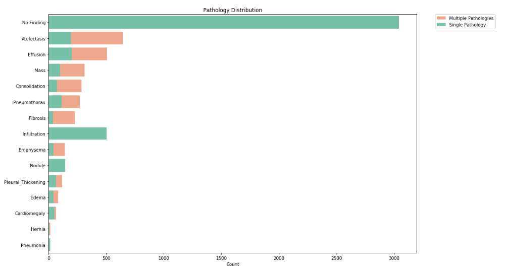
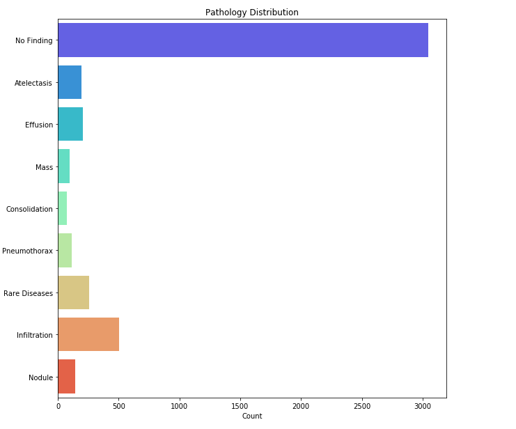
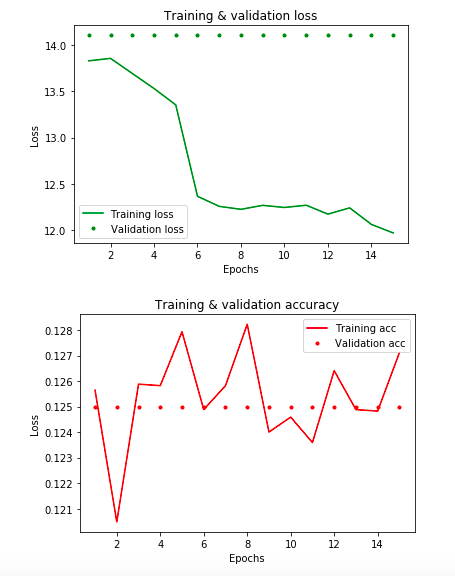
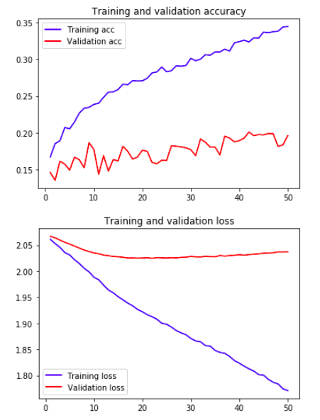

# Identifying Chest X-Ray Pathology using Deep Learning 

## Project Motivation
One of the most exciting applications of machine learning, particularly deep learning, is the opportunity to improve medical technology. 

If we are able to automate medical diagnostics, with even better accuracy than currently possible, this could potentially improve:

(1) access to diagnostic services especially in medically underserved populations
(2) health outcomes as conditions are more readily and accurately identified  

## NIH Chest X-Ray Dataset
The publicly available NIH-14 chest x-ray dataset (https://nihcc.app.box.com/v/ChestXray-NIHCC) consists of 112,120 de-identified chest x-ray images and associated data (such as patient sex, and patient age). The dataset's authors labeled the images using natural language processing to text-mine disease classifications from corresponding radiological reports. A random subset of the associated **reports** (not the images, see conclusions below) were independently labeled by two annotators to assess the degree of agreement, with an estimated label accuracy of >90%. 

Due to computer limitations and the size of the images (1024x1024), a random sample of the original dataset was used. This sample consisted of 5,606 images or 5% of the original dataset. 

## Data Processing
To facilitate processing, the following was done:

(1) The 1024x1024 images were resized to 128x128. 

(2) Some images were labeled with multiple pathologies (so a single x-ray may be labeled as: nodule, effusion, pneumothorax). In total, 1027 images were diagnosed with multiple pathologies. To facilitate ease of classification and model training, these images were removed from the dataset. 

(3) The original labels were also redefined as: 

0: No Finding
1: Consolidation
2: Infiltration
3: Pneumothorax
4: Effusion
5: Nodule
6: Atelectasis
7: Rare diseases (edema, emphysema, fibrosis, pneumona, pleural thickening, cardiomegaly, hernia)

This resulted in 4,527 128x128 images and their associated labels, which were saved as two arrays.

## Class Imbalance
After visualizing the distribution of pathologies in the cleaned dataset, it was clear that there was class imbalance. 3,044 (~67%) of the data were labeled as no finding. 

To address class imbalance, the following strategies were utilized:

**Multi-Layer Perceptron** 
* Balanced class weights
* Random oversampling

**Convolutional Neural Network**
* Balanced class weights
* Random oversampling
* Data augmentation 

## Libraries
Keras and TensorFlow were used. 

## Hyperparameter Tuning
The following hyperparameters were adjusted to create the best-fitting model:
* Epochs
* Optimizers 
* Regularizers 
* Activation functions 
* Batch size
* Learning rate and decay

Network architecture (number of neurons, number of layers) was also adjusted.

## Multi-Layer Perceptrons (Feed-Forward Neural Network)

In assessing model performance, training and validation loss and accuracy were assessed. Originally, the model's training and validation metrics remained constant which indicated that the model was not 'learning', after however many epochs. More complexity was added to the model architecture (more neurons and more layers). The training loss and accuracy improved. However, the validation loss and accuracy remained constant, even after:

* Addressing class imbalance (trying both balanced class weights and random oversampling) 
* Changing optimizers (SGD, Adam)
* Decreasing the learning rate and decay
* Trying L1, L2, and dropout regularization 

Convolutional neural networks were also tried. 

## Convolutional Neural Network

Validation metrics did not remain constant as they did with MLPs. However, there was a vast difference between training and validation loss, indicating that the model failed to converge and suggesting overfitting. 

After trying several methods to address overfitting as discussed above, additional research was conducted to determine whether potential issues existed with the data itself. 

## Conclusions
The limitations of the data were discussed in depth in a radiologist's blog:

https://lukeoakdenrayner.wordpress.com/2017/12/18/the-chestxray14-dataset-problems/

* The images were labeled based on clinical reports associated with the images, not solely based on the images themselves. Thus, diagnoses may be based on additional clinical factors not present in the images.
* Similarly, the annotators based their assessments on the reports and not on the images 
* Upon further examination, the label accuracy was actually quite low for many of these pathologies
* Some images were of 'treated' pathologies, so they were not representative of an undiagnosed pathology which is the intent of the model

As such, the models were essentially fitting on noise because the labels were so internally inconsistent which explains the issues with training and validation metrics.

For future projects, the data must be explored even more in-depth to prevent such issues.  
